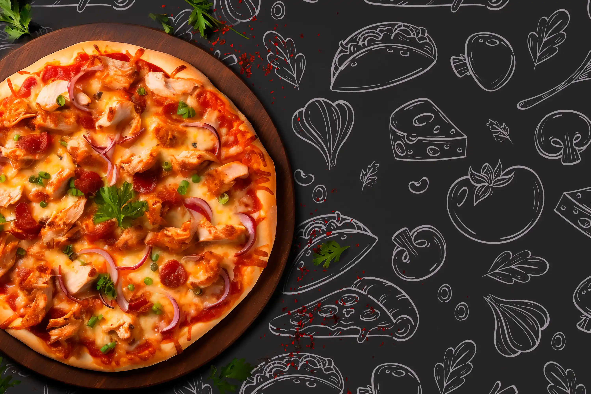

# 🍔 Foodie Spot

**Foodie Spot** est une application React simple pour un restaurant fictif de fast-food. Elle permet aux utilisateurs de :

- 📖 Visualiser le menu
- 🧾 Commander un ou plusieurs articles (menus et/ou boissons)
- 🪑 Réserver une table
- ✅ Recevoir une confirmation de commande

---

## 📸 Aperçu


> Interface moderne avec un menu dynamique, une section de réservation et un formulaire de commande.

---

## 🚀 Fonctionnalités

- 🖼️ Interface responsive moderne
- 🧾 Formulaire de commande (menu, boisson, quantité)
- 🧮 Possibilité d'ajouter plusieurs articles
- 💬 Confirmation de commande via une modale
- 📅 Réservation de table (nom, date, heure, nombre de personnes)
- 🍟 Menu dynamique avec images, prix, description
- 🔗 Navigation fluide entre les sections

---

## ⚙️ Installation

```bash
# Clone le repo
git clone https://github.com/Blvck-F/foodie-spot.git
cd foodie-spot

# Installe les dépendances
pnpm install

# Démarre le serveur de développement
ppnpm run dev


📁 Structure du projet
src/
├── assets/              # Images (burgers, boissons, etc.)
├── components/          # Composants UI (Navbar, Footer, Hero, Book, etc.)
├── pages/               # Page principale (Home)
├── App.jsx              # Root component
├── main.jsx             # Point d'entrée React
└── index.css            # Styles globaux (via Tailwind CSS)


🧑‍🍳 Technologies utilisées

React (Vite)
Tailwind CSS
React Icons
JSX / Modern JavaScript
FontAwesome et RemixIcons pour les icônes

🧪 Script
# Démarrage en développement
pnpm run dev

# Build production
pnpm run build

# Aperçu production locale
pnpm run preview


📌 To-Do / Idées d'amélioration

 Ajouter un backend DJANGO pour sauvegarder les commandes

 Création et envoie de QRcode après commande effectuée

 Valider les emails et données dans les formulaires

 Ajouter un système d'authentification admin

 Améliorer le système de réservation (calendrier, slots horaires)

 Support multi-langue (FR/EN)


🤝 Crédits
Projet réalisé à des fins d'apprentissage (ou de démonstration).
Design & développement par [Ton Prénom / Pseudo]


📄 Licence
Ce projet est open-source — libre à toi de le réutiliser ou de l'améliorer !